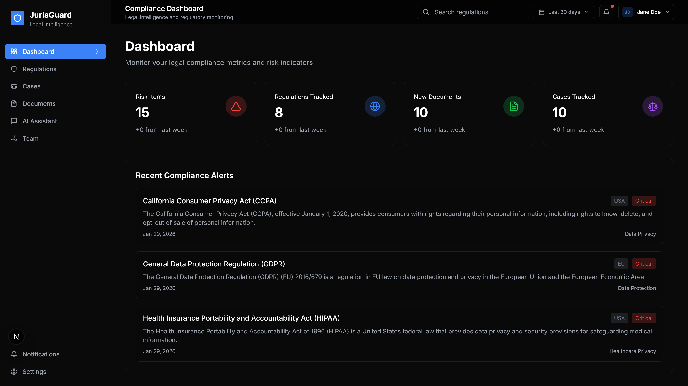
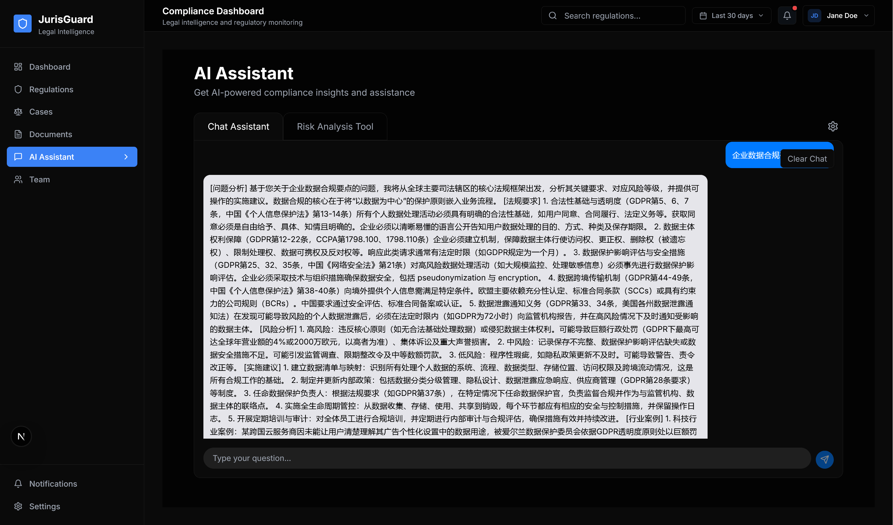
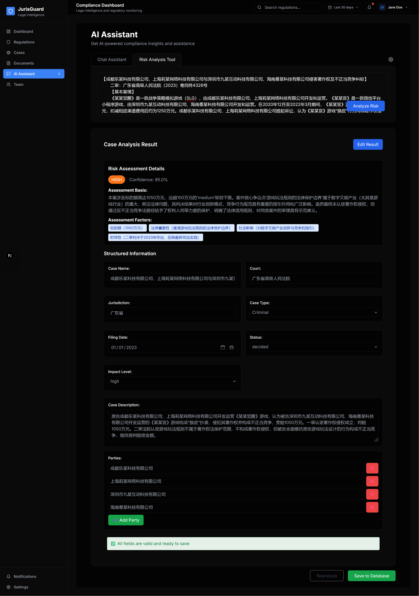
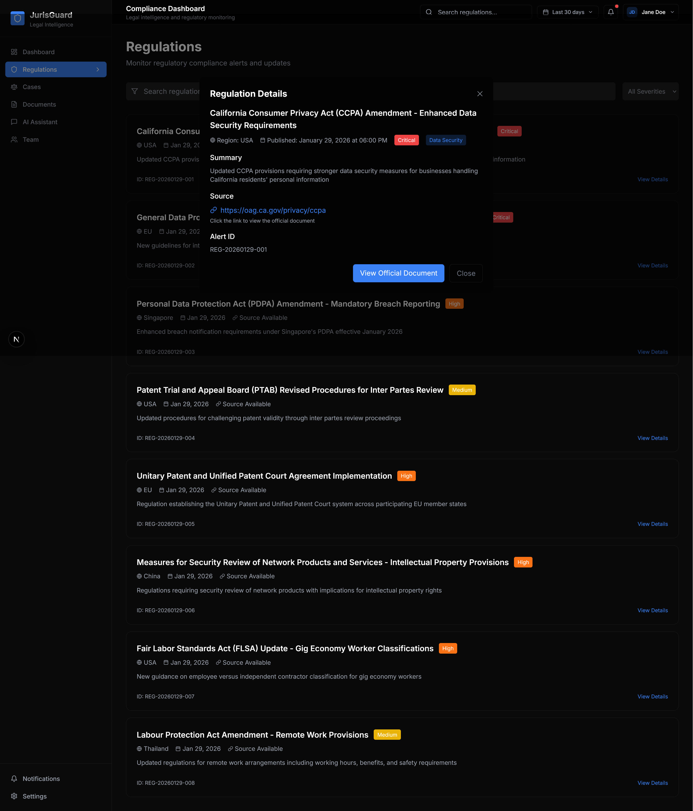
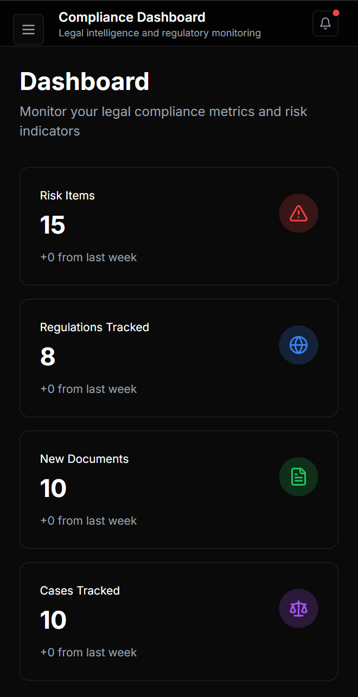

# JurisGuard 🛡️

> AI驱动的法律合规管理平台 - 智能化法规追踪与风险评估

[](https://opensource.org/licenses/MIT)
[](https://nextjs.org/)
[](https://reactjs.org/)

[English](#english) | [中文](#中文)

---

## 中文

### 📋 项目简介

JurisGuard 是一个基于AI技术的法律合规管理平台，专为法律专业人士和企业合规部门设计。通过智能化的法规追踪、风险评估和法律咨询功能，帮助用户实时掌握全球法规动态，降低合规风险。

**核心价值**：将复杂的多法域合规管理简化为智能化操作，提升法律工作效率和准确性。

---

### ✨ 核心功能

#### 🌐 智能化法规追踪
- **实时监控**：自动化获取欧美、东南亚等主要法域的最新法规变化
- **多源数据**：支持GitHub Actions驱动的自动化数据更新机制
- **时效性保障**：确保法规信息的及时性和准确性

#### 🤖 AI法律专家助手
- **专业角色建模**：模拟15年以上跨国企业合规经验的法务专家
- **多法域支持**：深度覆盖GDPR、EU AI Act、CCPA等全球主要法规体系
- **结构化输出**：遵循Westlaw等专业法律数据库标准格式
- **权威咨询**：提供专业级的法律解读和风险评估

#### 📊 智能合规仪表板
- **可视化监控**：实时展示合规警报与风险指标
- **风险评估雷达**：多维度可视化展示合规风险等级
- **数据统计面板**：关键指标实时监控和趋势分析
- **智能筛选**：按地区、法规类型、风险等级灵活过滤

#### 📋 全方位合规管理
- **法规知识库**：丰富的法律案例与判例分析
- **文档管理中心**：合同模板、政策文件集中管理
- **风险量化评估**：基于财务、法律、业务等多维度的综合风险评分

#### 🔧 企业级功能增强
- **公司业务对齐**：AI助手可根据公司具体业务背景提供定制化合规建议
- **风险分级评分**：量化风险评估模型，业务关联度(40%) + 惩罚严苛度(40%) + 合规紧急度(20%)
- **法律术语对齐**：专业法律术语识别与标准化，确保AI输出的准确性和专业性

---

### 🛠️ 技术栈

#### 🚀 前端架构
- **Next.js 16**：最新版框架，支持App Router、Server Components、Streaming等前沿特性
- **React 18**：现代化UI构建，充分利用并发渲染和Hooks机制
- **TypeScript**：强类型保障，提升代码可维护性与开发体验
- **Tailwind CSS**：原子化CSS框架，高效构建美观响应式界面

#### 🤖 AI与数据处理
- **多AI后端支持**：无缝集成OpenRouter、Hugging Face、Together AI等主流平台
- **智能数据管道**：自动化法规爬取与处理，通过GitHub Actions实现持续更新
- **结构化数据管理**：统一的数据模型与状态管理方案

#### ✨ 开发体验
- **现代构建工具**：Webpack 5 + SWC编译，极速开发体验
- **代码质量保障**：ESLint + Prettier + TypeScript严格模式，保证代码规范
- **动画与交互**：Framer Motion实现流畅的UI过渡效果
- **性能优化**：图片懒加载、代码分割、预加载等优化策略

#### 🧠 AI智能增强
- **上下文感知**：动态公司背景注入，AI可结合具体业务场景分析
- **量化风险模型**：多因子评分算法，科学评估法律风险等级
- **术语标准化**：专业法律术语对齐机制，防止AI幻觉，确保输出准确性
- **用户体验优化**：柔和舒适的对话界面，减少视觉疲劳

---

### 🚀 快速开始

#### 1. 克隆项目

```bash
git clone https://github.com/Casper-hue/JurisGuard.git
cd JurisGuard
```

#### 2. 安装依赖

```bash
npm install
```

#### 3. 配置环境变量

复制 `.env.example` 文件为 `.env` 并配置相关API密钥：

```bash
# 支持多种AI后端
OPENROUTER_API_KEY=your_openrouter_api_key
HUGGINGFACE_API_KEY=your_huggingface_api_key
TOGETHER_API_KEY=your_together_api_key
```

#### 4. 启动开发服务器

```bash
npm run dev
```

访问 `http://localhost:3000` 查看应用

#### 5. 数据更新（可选）

```bash
# 使用默认AI后端
npm run crawl-data

# 使用特定AI后端
npm run crawl-data-openrouter
npm run crawl-data-huggingface
npm run crawl-data-together
```

---

### 📂 项目结构

```
JurisGuard/
├── app/                    # Next.js App Router
│   ├── dashboard/          # 智能合规仪表板
│   ├── compliance/         # 法规管理页面
│   ├── cases/             # 案例管理页面
│   ├── documents/         # 文档管理页面
│   ├── ai-assistant/      # AI助手页面
│   └── api/               # API路由
├── components/            # 可复用组件
│   ├── ui/               # UI组件库
│   ├── MainLayout.tsx    # 主布局组件
│   └── risk-analyzer.tsx # 风险分析组件
├── lib/                  # 工具库
│   ├── ai-service.ts     # AI服务
│   ├── crawler-service.ts # 爬虫服务
│   └── utils.ts          # 工具函数
├── data/                 # 静态数据
│   ├── compliance-data.json
│   ├── cases-data.json
│   └── documents-data.json
├── public/               # 公共资源
│   └── data/            # 公共数据文件
├── scripts/              # 脚本文件
│   └── crawl-and-process.js # 数据爬取处理脚本
└── types/                # TypeScript类型定义
    └── index.ts
```

---

### � 使用场景

#### 1. 企业合规部门
- **实时监控**：7×24小时监控目标市场的法规变化
- **风险评估**：智能化识别潜在合规风险
- **决策支持**：为管理层提供数据驱动的合规决策

#### 2. 律师事务所
- **法规研究**：快速获取最新法规动态和专业解读
- **案例参考**：智能检索相关法律案例和判例
- **效率提升**：自动化处理重复性法律研究工作

#### 3. 跨国企业
- **多法域管理**：统一管理不同国家的合规要求
- **风险预警**：及时发现跨境经营的法律风险
- **成本控制**：降低合规管理的人力和时间成本

#### 4. 个人法律从业者
- **专业工具**：获得资深法务专家级别的咨询服务
- **知识更新**：持续学习最新的法规变化和趋势
- **效率优化**：提升个人法律工作的专业性和效率

---

### 📸 功能演示

#### 仪表板界面

*智能合规仪表板，实时展示风险指标和合规警报*

#### AI法律助手

*AI法律专家助手界面，提供专业法规解读和风险评估*

#### AI文本分析与风险评估

*AI文本分析功能，支持手动上传文本的结构化分析和量化风险评估*

#### 法规管理

*法规管理页面，展示最新法规动态和详细信息*

#### 响应式设计

*响应式设计，完美适配桌面和移动设备*

---

### 🌟 项目特色

#### 💼 专业法律科技融合
- **深度领域专精**：聚焦法律合规场景，解决真实业务痛点
- **前沿技术应用**：AI+Web技术赋能传统法律工作流程
- **用户体验导向**：深度调研法律从业者需求，打造专业化工作台

#### 🧠 AI智能增强
- **专家级角色建模**：超越通用LLM，模拟资深法务专家思维模式
- **结构化专业输出**：遵循Westlaw等专业法律数据库标准格式
- **法规溯源能力**：每个AI回答都提供法规依据与官方链接
- **持续学习进化**：通过GitHub Actions自动化更新法规知识库

#### 🌐 全球化合规支持
- **多法域覆盖**：支持GDPR、EU AI Act、CCPA等主流法规体系
- **实时法规追踪**：自动化获取最新法规变化，确保信息时效性
- **跨区域对比**：提供不同法域间法规差异的智能分析

---

### 🚀 发展蓝图

#### 🔄 当前版本亮点 (v1.0)
- ✅ **AI驱动合规分析** - 智能识别法律文本风险点
- ✅ **自动化法规更新** - GitHub Actions驱动的实时法规爬取
- ✅ **双语国际化** - 完整中英文支持，全球化用户体验
- ✅ **全平台兼容** - 响应式设计，完美适配桌面与移动设备
- ✅ **企业级定制** - 公司业务背景配置，个性化合规建议
- ✅ **量化风险模型** - 科学的风险评分与等级划分
- ✅ **专业术语对齐** - 防止AI幻觉，确保输出准确性

#### 🎯 下一阶段 (v1.1-v1.3)
- [ ] **团队协作套件** - 多用户权限管理，团队数据安全共享
- [ ] **智能报告生成** - AI辅助生成专业合规报告与建议
- [ ] **开放API平台** - 标准RESTful接口，便于第三方系统集成
- [ ] **高级可视化** - 丰富的图表组件，深度数据分析洞察

#### 🌟 未来展望 (v2.0+)
- [ ] **企业级监控** - 7×24小时实时合规状态监控与告警
- [ ] **预测性分析** - 基于法规趋势的前瞻性风险预测
- [ ] **区块链验证** - 不可篡改的合规证明与审计轨迹
- [ ] **行业定制化** - 针对金融、医疗、科技等垂直领域的专业模块

---

### 🤝 贡献

欢迎贡献代码、提出建议或报告问题！

1. Fork 项目
2. 创建功能分支 (`git checkout -b feature/AmazingFeature`)
3. 提交更改 (`git commit -m 'Add some AmazingFeature'`)
4. 推送到分支 (`git push origin feature/AmazingFeature`)
5. 开启 Pull Request

---

### 📄 许可证

本项目采用 MIT 许可证 - 查看 [LICENSE](LICENSE) 文件了解详情

---

### 📞 联系方式

- 项目主页：https://github.com/Casper-hue/JurisGuard
- 问题反馈：https://github.com/Casper-hue/JurisGuard/issues

---

## English

*English version coming soon...*

---

## 致谢与后记

感谢LLM模型的强大能力，为这个项目的开发提供了无限可能。感谢爬虫开源项目，为法律文本的获取和处理提供了便捷的工具。感谢所有阳光的午后和瞌睡的小鸟，让我觉得做点什么都有意义。希望科技发展的未来，人们可以打破知识和信息的壁垒，而不是被过量的信息和未知的风险所困扰。