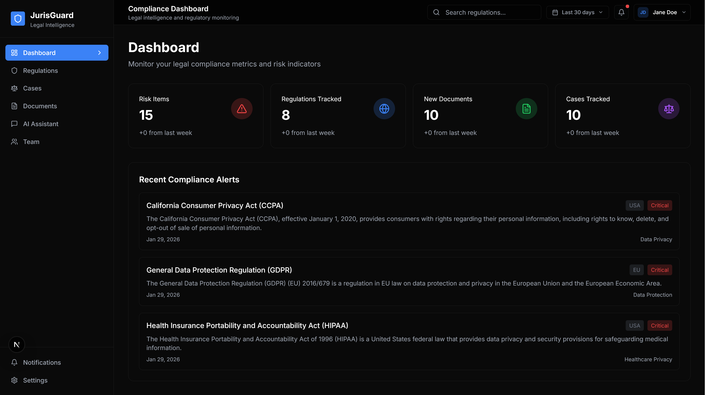
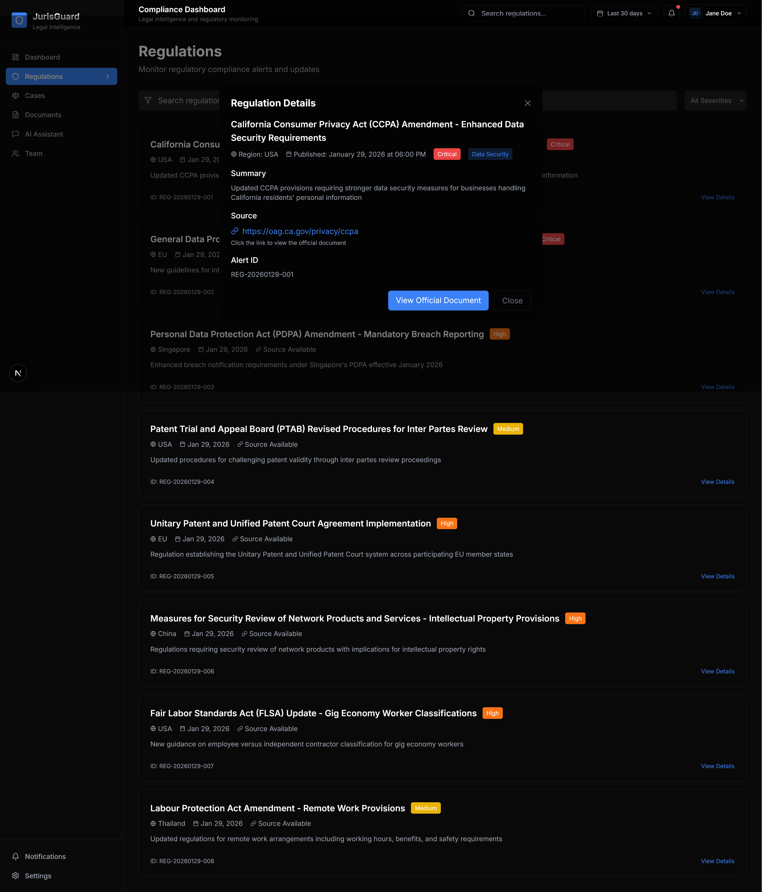
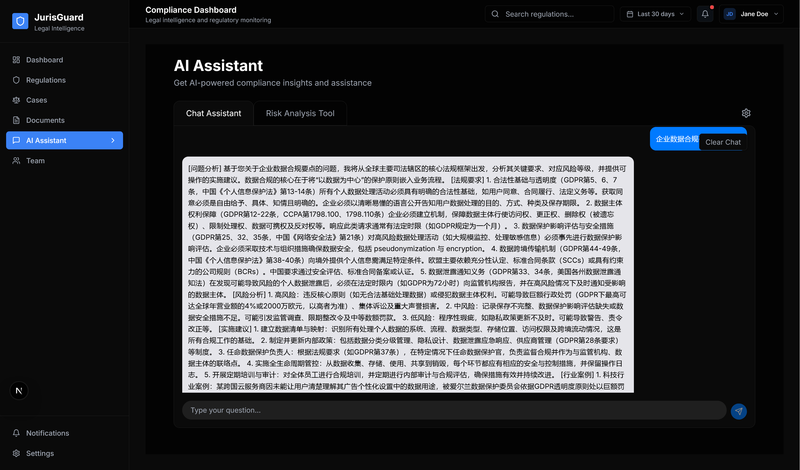
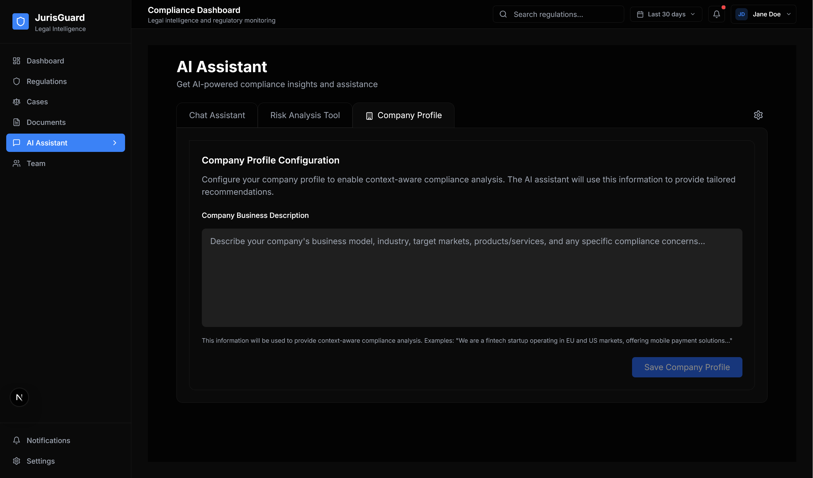
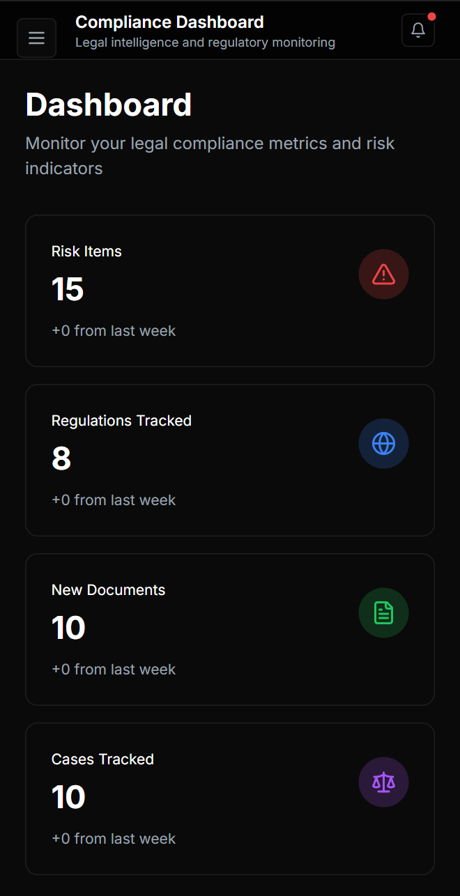

# JurisGuard

A cross-border compliance monitoring platform that automates regulatory tracking for legal teams managing multi-jurisdictional updates.

---

## Project Status

**Demo project: Core workflow and AI Q&A are implemented. Crawler interfaces are scaffolded but not connected to real data sources — the current display uses mock data.**

### Completed and Running
- ✅ Frontend: Dashboard, compliance tracking, case library, document library, AI assistant — all pages functional
- ✅ AI Q&A system: Supports compliance consultation after configuring API key
- ✅ Risk analysis tool: Input legal text, AI extracts key information and assesses risk
- ✅ Company profile: Configure business context, AI provides tailored recommendations
- ✅ Data display: Filtering, search, detail view and other interactive features

### Scaffolded but Not Connected
- ⚠️ Crawler service: Code framework complete, currently reads mock data from local JSON files, not connected to real government websites
- ⚠️ Data pipeline: GitHub Actions scheduled tasks configured, but not actually scraping real regulatory data
- ⚠️ The 8 regulation entries currently displayed (GDPR, CCPA, AI Act, etc.) are sample data, not real-time captures

---

## Problem Statement

Legal teams operating across borders face a repetitive, time-consuming pain point:

**Manual regulatory monitoring doesn't scale**
- Manually checking multiple government websites daily for new regulations
- Parsing legal documents to determine which changes are business-relevant
- Assessing the business impact of each regulatory change individually
- Maintaining internal compliance documentation to keep the team aligned

Companies either dedicate significant headcount to monitoring, or accept the risk of missing critical regulatory changes.

---

## Solution

JurisGuard automates the "monitor → parse → analyze" workflow:

1. **Automated collection**: Scheduled scraping of regulatory sources (interfaces scaffolded, awaiting real data source connection)
2. **Structured processing**: Standardizes heterogeneous legal documents into a queryable format
3. **AI-assisted analysis**: LLM-based system identifies relevant changes and assesses business impact
4. **User interface**: Dashboard with filtering, search, and drill-down into specific regulation items

**Current scope**: EU (GDPR, AI Act), US (CCPA), and selected ASEAN jurisdictions. Architecture supports adding new data sources.

---

## Design Rationale

Based on 3 years of in-house legal experience understanding compliance work, I decomposed regulatory monitoring into key components:

### Risk Assessment Logic
Legal directors face a flood of regulatory updates daily and need to prioritize quickly. I designed a multi-factor scoring model:
- **Business relevance (40%)**: How directly the regulation affects company operations
- **Penalty severity (40%)**: Potential financial/legal consequences of non-compliance
- **Urgency (20%)**: Time pressure from compliance deadlines

Weights are configurable based on company risk appetite — learned from real work experience: different industries and company stages have different risk tolerances.

### Why Scheduled Batch Processing Over Real-Time
Regulatory changes are not real-time events. Government website updates and official gazette publications follow fixed rhythms. Scheduled scraping (daily/weekly) matches the actual cadence of regulatory updates while keeping infrastructure costs manageable.

### Why Multiple AI Providers
API availability redundancy + cost optimization (different models for different tasks: summarization vs. structured extraction). Also learned from project experience: single dependency is a risk point in production environments.

---

## Features

### Core Features
- **Regulatory dashboard**: Filter recent regulatory changes by jurisdiction, risk level, and date
- **Document library**: Centralized management of compliance-related documents
- **Case database**: Reference library of legal precedents and enforcement actions
- **AI assistant**: LLM-powered regulatory Q&A and document analysis interface

### Current Limitations
- **No real-time alerts**: Batch processing means updates lag by up to 24 hours
- **Manual source configuration**: Adding new regulatory sources requires code changes
- **AI hallucination risk**: LLM outputs are not guaranteed accurate; human review required
- **Single-user system**: No multi-user authentication or role-based access control yet

---

## Screenshots

### Dashboard


### Compliance Tracking


### AI Assistant


### Company Profile Configuration


### Mobile View


---

## Tech Stack

- **Frontend**: Next.js 16 (App Router) + React 18 + TypeScript + Tailwind CSS
- **AI layer**: Supports OpenRouter / Hugging Face / Together AI / DeepSeek and other LLM APIs
- **Data pipeline**: Node.js scripts + GitHub Actions (scheduled tasks)
- **Deployment**: Supports Vercel / Docker / Sealos

---

## From Demo to Production: What's Needed

Building this project made me clearly see the gap between a demo and an enterprise system:

**Data layer** (the biggest gap currently)
- Connect real crawler data sources, replace current mock data
- Replace JSON file storage with a database
- Establish data validation and quality monitoring

**Product layer**
- User management and access control (RBAC, SSO)
- Workflow engine (approval chains, task assignment)
- Integration interfaces with contract management, e-signature systems

**Operations layer**
- Application monitoring and error tracking
- Compliant data storage and encryption
- SLA commitments and availability guarantees

These gaps are exactly what I understand from legal work: between "usable" and "trustworthy" requires systematic engineering investment.

---

## Running Locally

### Prerequisites
- Node.js 18+
- LLM API key (optional — uses Mock mode if not configured)

### Installation

```bash
git clone https://github.com/Casper-hue/JurisGuard.git
cd JurisGuard
npm install
```

### Configuration (Optional)

To use real AI services, create a `.env` file:

```bash
OPENROUTER_API_KEY=your_key_here
HUGGINGFACE_API_KEY=your_key_here  
TOGETHER_API_KEY=your_key_here
```

You can also skip API key configuration and set it directly in the page settings, or use Mock mode to explore features.

### Start

```bash
npm run dev  # Start dev server, visit localhost:3000
```

### Using the AI Assistant
1. Click the settings icon in the top right
2. Select a free API (OpenRouter/HuggingFace/Together) or enter a custom API key
3. Start chatting, or switch to the "Risk Analysis" tab to input legal text for analysis
4. Optional: Configure company business context in the "Company Profile" tab for tailored recommendations

---

## Project Background

This project was born during a career transition — from in-house legal (3 years: compliance, contracts, IP) to Legal Operations.

**Core question**: How can someone with a legal background use technology to solve legal problems?

Not writing a "I can use Next.js" technical resume, but answering: once you understand the real pain points of legal work, can you use technology to make it a little better?

**What I learned**:
- The most time-consuming part of legal work isn't the legal analysis itself, but information collection and organization — that's exactly where automation adds value
- Risk assessment can't rely on intuition alone; it needs a quantifiable framework to support decisions
- AI in the legal domain is an assistive tool, not a replacement — so the design retains human review checkpoints

One week of part-time work, an honest demo project. The core workflow runs, data sources await connection, but it's enough to show: bridges can be built between law and technology.

---

## License

MIT License - See LICENSE file for details

---

## Contact

Project: [https://github.com/Casper-hue/JurisGuard](https://github.com/Casper-hue/JurisGuard)  
Issues: [https://github.com/Casper-hue/JurisGuard/issues](https://github.com/Casper-hue/JurisGuard/issues)
